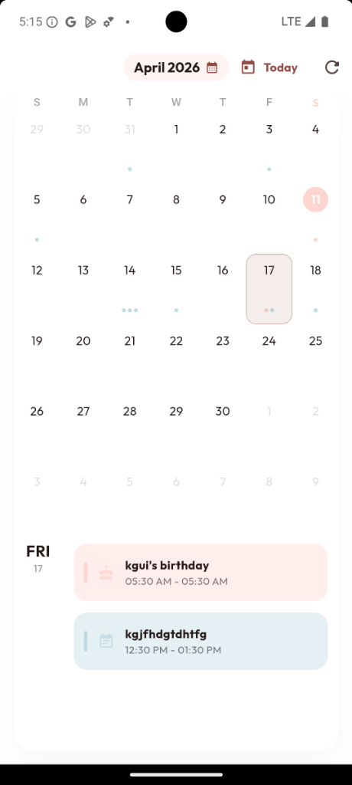
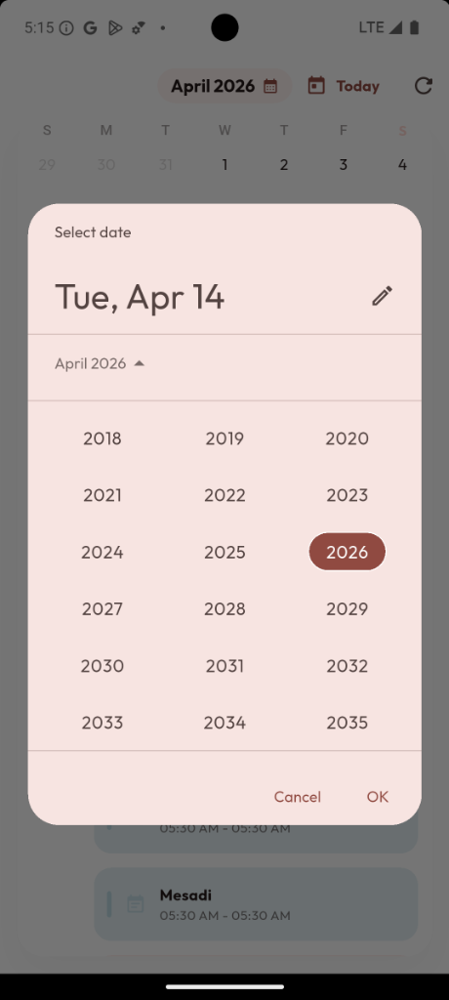
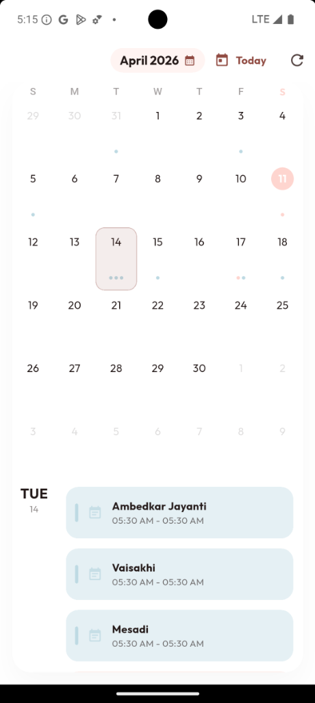

# SF Calendar Task

A Flutter calendar app built as part of the interview process. It reads events from the device's native calendar, displays them in a month view, and auto-categorizes entries by title — gym, birthday, work, meetings — into a small pastel palette with matching icons.

## Screenshots

<p align="center">
  
  
  
</p>

## What it does

- Month view backed by Syncfusion's calendar widget
- Reads events from the device's native calendar (permission-gated)
- Auto-fetches when the user swipes between months
- Categorizes events by title keywords into a 5-color palette with matching icons
- Jump-to-date picker and a one-tap "Today" button
- Light and dark themes that follow the system setting
- Empty-state handling for months with no events

## Stack

- **Flutter** with **Provider** for state management
- **syncfusion_flutter_calendar** for the calendar surface
- **device_calendar** for native event access
- **google_fonts**, **intl**, **timezone** for typography, formatting, and TZ handling

## Approach

The scope is a single feature, so the project uses a layered structure (models / controllers / repositories / views) rather than a feature-first one. At this size feature-first would be overhead; a layered split keeps the state layer, data access, and UI cleanly separated without imposing a boundary for a boundary's sake.

The repository layer exists so the event source is swappable. Right now it calls `device_calendar`, but replacing it with a server-backed source would be a single-file change that doesn't touch the controller or the views.

Provider was chosen over Riverpod and Bloc because the reactive surface is small — one controller holding the event list and the visible month. Bloc's ceremony isn't justified at this scope, and Riverpod's compile-time safety pays off more on larger feature graphs than it does here.

Event categorization is rule-based keyword matching on event titles. It works well for common patterns but has an obvious limitation: it's opinionated about what "gym" or "birthday" means and doesn't learn. In production I'd move the rule set to configuration (or a user-editable mapping) so categories can be updated without shipping a new build.

Syncfusion was used for the calendar surface rather than a custom implementation because it ships with solid swipe handling, appointment rendering, and view transitions. Rebuilding that from scratch wouldn't add value for this task.

## Project structure

```
lib/
├── models/             # Event and domain models
│   └── calendar_event.dart
├── controllers/        # Provider state
│   └── calendar_provider.dart
├── repositories/       # Device calendar access
│   └── calendar_repository.dart
├── views/              # Screens and widgets
│   ├── calendar_page.dart
│   └── widgets/
│       └── calendar_data_source.dart
└── main.dart           # Entry point, theme setup
```

## Running it

```bash
git clone <repository_url>
cd <project>
flutter pub get
flutter run
```

> [!NOTE]
> Grant calendar permission when prompted — the app reads events from the device's native calendar, so nothing shows up until permission is granted.
